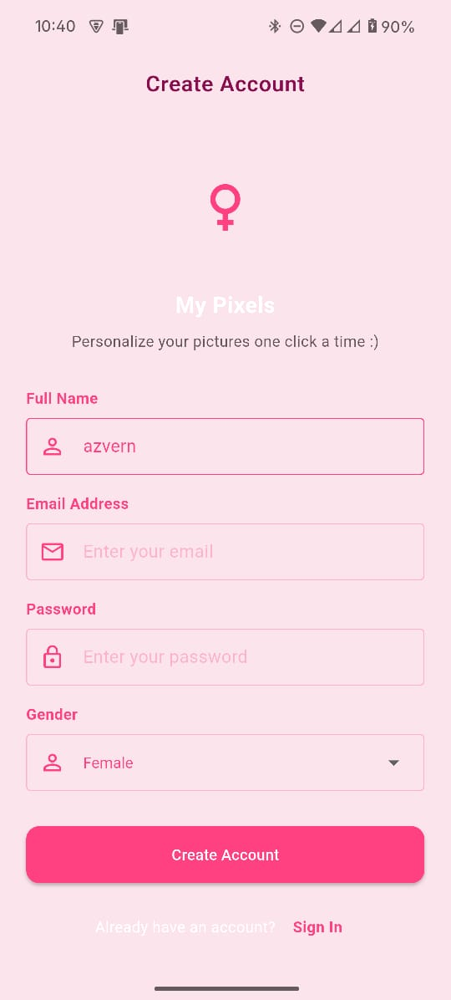
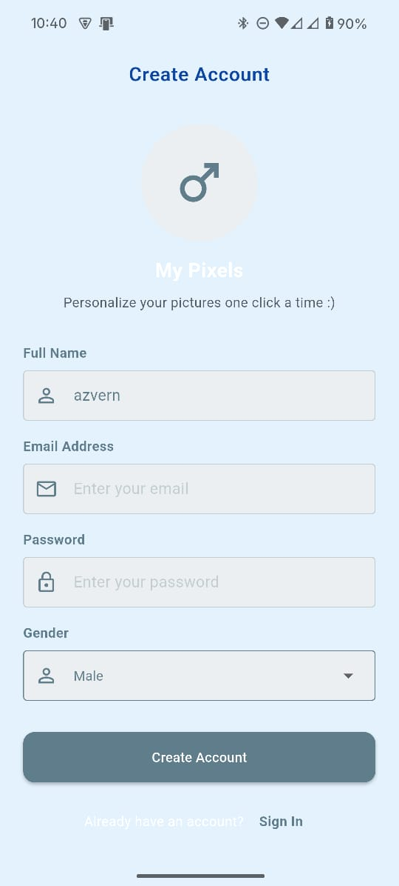
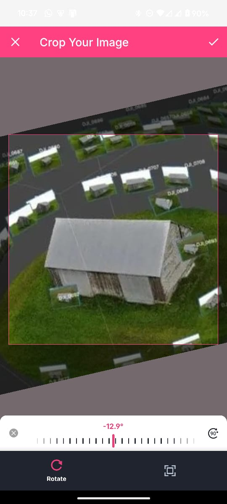
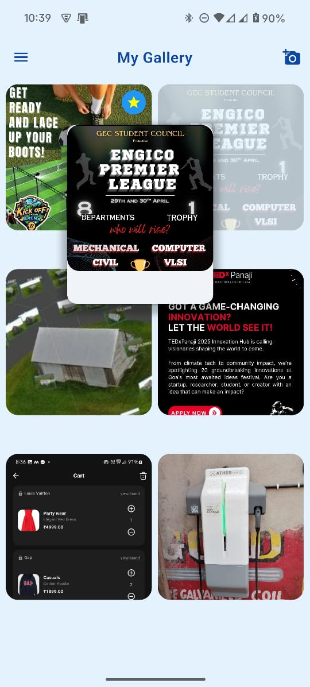

# Pixel Gallery App

A Flutter app that lets users create an account, upload and crop images, and organize their personal gallery with a drag-and-drop interface.  
The app offers a gender-personalized UI theme and smooth animations to enhance the experience.

## 🚀 How to Run the App

### 1. Install Flutter
Follow the official Flutter installation guide:  
[Flutter Installation Guide](https://flutter.dev/docs/get-started/install)

### 2. Clone the Project

```bash
git clone https://github.com/your-username/your-repo.git
cd your-repo
```

### 3. Get Dependencies

Run the following command to fetch dependencies:

```bash
flutter pub get
```

### 4. Run the App

- Connect a physical device or start an emulator.
- Run the following command to launch the app:

```bash
flutter run
```

## 📦 Additional Libraries Used

| Package                  | Purpose                                                   |
|--------------------------|-----------------------------------------------------------|
| `provider`               | State management for user authentication and gallery images. |
| `go_router`              | Navigation between signup, login, and gallery screens.    |
| `shared_preferences`     | Local storage of user profile data (name, email, gender). |
| `flutter_secure_storage` | Secure storage of passwords.                             |
| `image_picker`           | Picking images from the device gallery.                   |
| `image_cropper`          | Cropping selected images into square shapes.             |
| `flutter_animate`        | Smooth animations for screen transitions and widgets.     |
| `reorderables`           | Drag-and-drop reordering of images inside the gallery.    |
| `path_provider`          | Finding app-specific storage directories.                |
| `path`                   | Manipulating file paths easily when saving images.        |
| `services`               | Haptic feedback on drag and drop of images.                |

## 🖼️ Screenshots

| Female Signup | Male Signup | Login Page | Image Edit & Crop | Drag & Drop | Edit & Delete | Edit Profile |
|:-------------:|:-----------:|:----------:|:-----------------:|:-----------:|:-------------:|:------------:|
|  |  |  |  |  |  |  |


## 🎯 Notes
- The app uses `flutter_animate` for extra UI polish but is fully usable without it too[functionality removed due to app breaking bugs for now]
- User credentials are stored locally and password is secured using secure_storage().
- All functionality has been implemented as per requirements but UI is still not upto the mark.
- Added user profile edit screen
